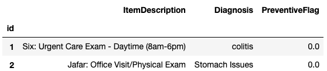

# NLP analysis and classification of a dataset of claims
---
### Executive Summary: 
This project applies natural language processing (NLP) techniques to classify claims data using text features. A binary classifier was developed to predict the PreventiveFlag label from descriptions and diagnoses. The workflow included exploratory data analysis, text preprocessing, feature engineering with tf-idf, and model evaluation across multiple machine learning algorithms.

Key findings:
- The dataset contained over 6,000 unique words after preprocessing.
- Gaussian Naïve Bayes, AdaBoost, and Decision Trees performed best under different feature and n-gram settings.
- Optimized classifiers improved the AUC score by ~1% compared to baseline models.
- Removing extreme outliers improved generalization, while duplicates unexpectedly enhanced performance.
The results highlight the trade-offs between feature dimensionality, n-gram selection, and classifier choice. Future work may explore advanced embeddings (e.g., Word2Vec) and more effective strategies for handling class imbalance.

### Description:
- Use the data in p2_data.csv to build a binary classifier that predicts the PreventiveFlag label using the provided text features.

### Files: 
- The data folder has the csv files provided by source. 
- The graphics folder contains the charts and images used for the analysis. 
- The results folder holds 2 csv files: 
    - One with the prediction of the test set and 
    - The second one has the performance metrics performed by the baseline of classifiers through different parameters. 
- The python file "myfunk" has the functions used in the analysis. 
- The jupyter notebook is divided in:
    1. Importing customized functions and Loading Data
    2. Exploratory Data Analysis
    3. Experiment Analysis
    4. Definition of variables
    5. Comparisson of the baseline vs tuned models
    6. Training and Validation
    7. Results
    8. Prediction of the test set 
    9. Conclusion


    - It's a sequential notebook (Each cell should to be run in order). However the 8th block (Prediction of the test set) can be run after blocks #1 and #4.  

---
### 1. Dataset and EDA

The dataset consists of 11,000 rows and three columns: two text columns and one target column represented by float values of 0.0 and 1.0, as shown below: 



An initial analysis revealed that the dataset contained: 
- 4,541 unique words, numbers, and symbols in the Item Description column 
- 2,029 unique words, numbers, and symbols in the Diagnosis column.

#### Statistics for samples of class 1

```python
f, axarr = plt.subplots(2,3,figsize=(20,8))
stats_class(data, f, axarr, 1.0) 
f.savefig(path+'/graphics/class1_stats.png', dpi=f.dpi)
```


#### Statistics for samples of class 0

```python
f, axarr = plt.subplots(2,3,figsize=(20,8))
stats_class(data, f, axarr, 0.0)
f.savefig(path+'/graphics/class0_stats.png', dpi=f.dpi)
```

In the Item description field for class 0 (top row), have a normal-like distribution. The diagnosis field, however, has a few outliers with a character length exceeding 200. Some with more than 6 sentences and words above 50 count. They proved later to affect the prediction negatively, so I removed them.

#### Statistics for the whole dataset
```python
f, axarr = plt.subplots(2,3,figsize=(20,8))
stats_overall(data, f, axarr)             
f.savefig(path+'/graphics/dataset_stats.png', dpi=f.dpi)
```


An unpaired t-test between the two class distributions confirmed that there was no significant difference.

---
### 2. Experiment Analysis

As a preprocessing step, the item descriptions and diagnoses were merged and tokenized. Duplicated instances were removed, along with a few duplicates that had conflicting PreventiveFlag values. These contradictions were treated as noise for classification.
Additionally, pet names in the item descriptions were deemed irrelevant for prediction and removed.

After text cleaning and stop word removal, over 6,300 unique words remained.

The next step involved feature engineering. The text corpus was converted into a matrix of token counts (using CountVectorizer) and then transformed into a normalized tf-idf representation (using a tf-idf transformer). Feature selection was performed using the chi-square test, which identifies features most dependent on class membership and removes irrelevant ones.

Several classifiers from the Scikit-learn library (with default parameters) were trained across variations of feature counts, n-grams, stemming, lemmatization, or both. Stemming was ultimately selected, as it yielded higher performance scores. Data was split into training and validation sets (70%:30%). The performance metric was the Area Under the Curve (AUC), as it better captures class separation ability than accuracy, particularly given the imbalanced dataset.

Python code to reproduce this figure:
```python
results = pd.read_csv(path+"/results/experimentation_results.csv", index_col=0)
fig = nGrams_distribution(results, 'Val', 5, 'AUC', 1)
fig.savefig(path+'/graphics/StemmingAUCdistributions.png', dpi=fig.dpi)
```

The figure above shows the AUC score distributions for each classifier, grouped by n-grams and feature dimensionality quartiles (low < 0.3, mid, and high > 0.6). The third column (features above 4,000) does not include 1-grams because the training set contained fewer than 4,000 1-grams. However, the combinations of 2-grams and 3-grams exceeded this threshold.

- Random Forest (RF) and Stochastic Gradient Descent (SGD) classifiers performed best at lower dimensions and 1-grams.
- Decision Trees (DT) initially outperformed RF and SGD but declined in performance as dimensionality increased.
- Gaussian Naïve Bayes (GNB) stabilized around an AUC of ~0.858 with 2-grams and maintained competitive performance (>80%).
- AdaBoost (AB) showed strong performance in lower dimensions and improved further with higher n-grams.

This illustrates a trade-off between the number of features and the number of n-grams. RF and SGD, performing below 80%, were eliminated. GNB performed better with higher dimensionality, AB with higher n-grams, and DT with lower dimensionality and n-grams. A balanced model incorporating these three classifiers could use 2-grams with mid-level dimensionality.

Python code to reproduce this figure:
```python
# from sklearn import preprocessing
selected_baseline = ('DecisionTreeClassifier','GaussianNB','AdaBoostClassifier')

# cols = ['Phase','AUC', 'F1_C0', 'F1_C1', 'MSE', 'Prec_C0', 'Prec_C1', 'Recal_C0', 'Recal_C1','nFeats']
cols = ['Phase','AUC','nFeats']
res = results.loc[results.Phase.str.endswith(('DecisionTreeClassifier','GaussianNB','AdaBoostClassifier')),cols]\
            .groupby(['Phase','nFeats']).mean().reset_index()

cols = np.repeat(res.columns[2:].values,2)
fig, axes = plt.subplots(nrows = res.shape[1]-2, ncols = 2, figsize=(20,5*(res.shape[1]-2)))
plot_dimensionality_series(fig, axes, res, cols)
fig.savefig(path+'/graphics/auc_over_dimensions.png', dpi=fig.dpi)
```

The figure above shows AUC scores across feature counts. The red line indicates a normalized sum of the scores. Within the mid-range of features (2,350–3,850), classifiers peaked at 3,100 features. The optimal value was determined to be 3,550 features. When tested again with an 80%:20% train-validation split (a common rule of thumb), the model achieved its highest score with 4,200 features.

---
### 3. Baseline vs Tuned models


The figure above compares the baseline classifiers (exp1, with default parameters) against the tuned classifiers (exp2). The tuned models achieved a 1% improvement in AUC score. 
```python 
## --- Training and validation of Baseline and Tuned Classifiers
# These 2 functions will train the data and get the individual scores for each classifier in the set
# ETA ~ 14min
df_baseline = trupanion(data, clf_base, flags, 2)  # 7min
df_tuned = trupanion(data, clf_opt, flags, 2) # 7 min

## --- Metrics
# Plot baseline compared with tuned clfs
fig, axes = plt.subplots(nrows = 1, ncols = 2, figsize=(20,8))
cols = ['MSE', 'AUC', 'F1_C0', 'F1_C1', 'Prec_C0', 'Prec_C1','Recal_C0', 'Recal_C1']
comparisson_clfs(fig, axes, 
                 df_baseline.loc[(df_baseline.Phase=='Val Soft')|(df_baseline.Phase=='Val Hard')], 
                 df_tuned.loc[(df_tuned.Phase=='Val Soft')|(df_tuned.Phase=='Val Hard')],  
                 cols, 0.35)
fig.savefig(path+'/graphics/baselineVsOptimized.png', dpi=fig.dpi)
```

There's an improvement on the AUC score of 1% using the tuned classifiers. 

---
### 4. Results

```python
fig, axarr = plt.subplots(1,2,figsize=(15,4))
plot_curves(fig, axarr, y_train, y_train_pred, y_val, y_val_pred)
fig.savefig(path+'/graphics/TrainValRoCurve.png', dpi=fig.dpi)
```


The ROC curve (TPR vs. FPR) above shows that the validation and training scores are nearly identical, suggesting the model is unlikely to be overfitting.

The true positive rate (TPR, or Recall) on the vertical axis approaches 0.8, with almost no false positives. However, if maximizing true positives is the priority, lowering the decision threshold would classify more events as class 1. While this would increase the number of true positives, it would also raise the false positive rate, with about 20% more cases incorrectly classified. This trade-off represents a business decision.

---
### 5. Conclusion and future work

The AUC score decreased as expected when incorporating more variance from the validation set. Nevertheless, a larger dataset reduces the likelihood of overfitting.

To address class imbalance, I attempted to ensemble resampled datasets. Class 1 instances were divided into three unequal segments, each concatenated with all class 0 instances, and individual classifiers were assigned to them. However, this approach did not improve baseline performance. Alternative strategies could include engineering additional features for the minority class or increasing feature dimensionality with higher-order n-grams. With additional time, I would also consider applying Word2Vec embeddings and clustering them by class.

Interestingly, duplicate entries had a positive effect on classification. In the dataset containing duplicates and outliers, validation scores were highest across AUC and other metrics. However, in the final classification—where the validation set was merged with the training set—removing outliers resulted in the highest AUC and recall for the minority class.
