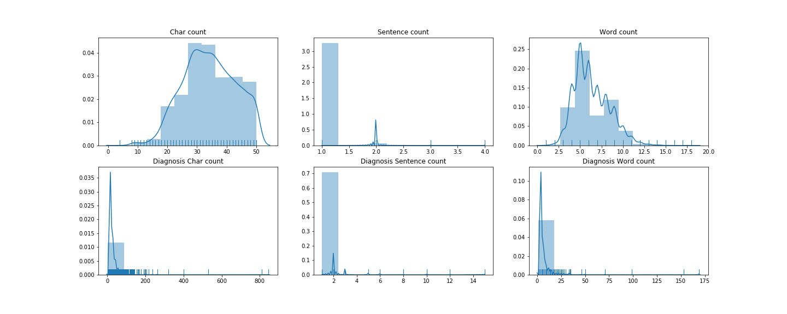
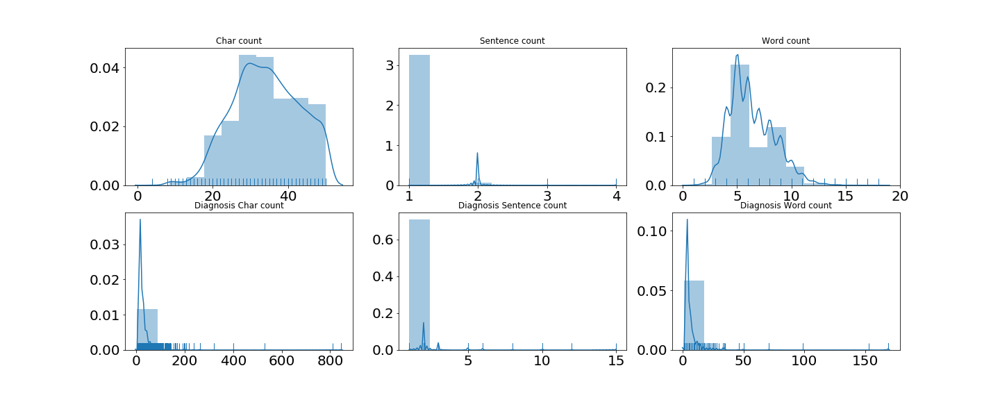
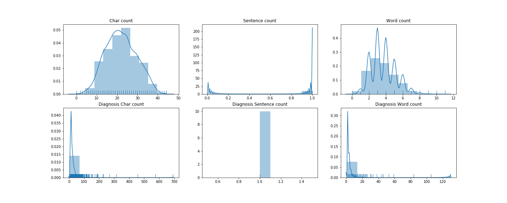
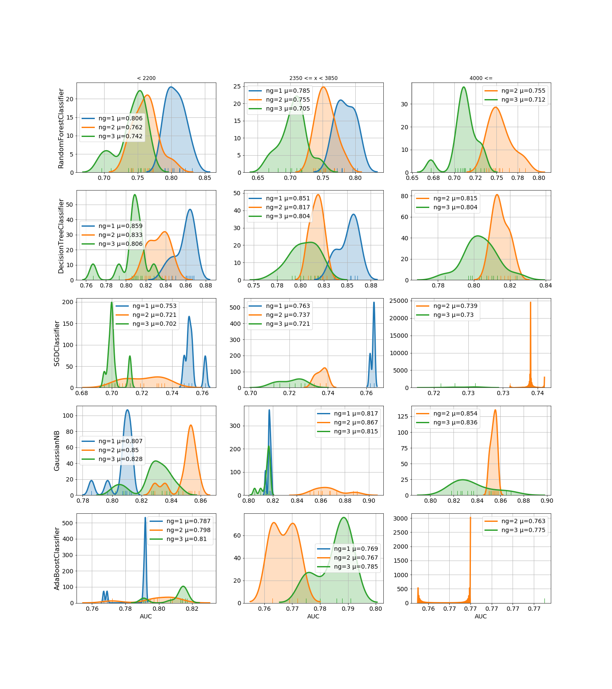
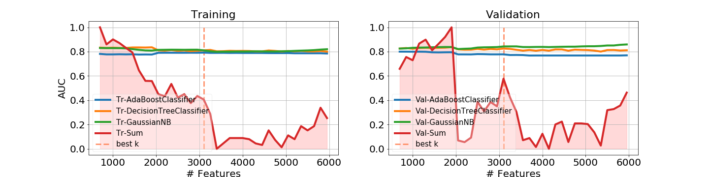
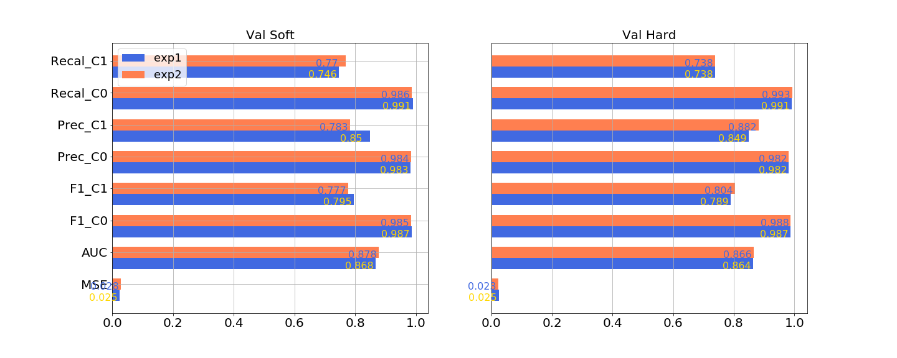
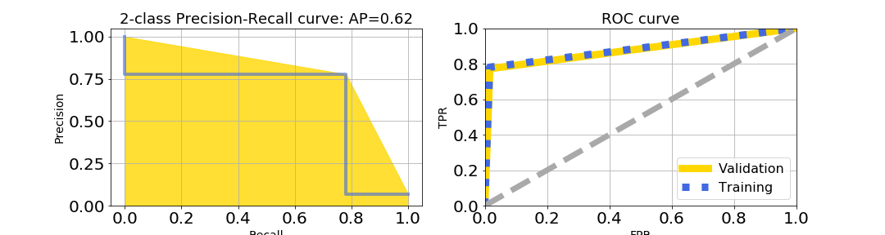

# pet_insurance
NLP analysis and classification of a dataset of claims


---
## Build a text classifier

Description:
- Our product does not cover routine, wellness or preventive care. 
- We believe that costs that pet owners can expect periodically and budget for should be separate from an insurance policy meant to cover accidents and illnesses.
- Use the data contained in p2_data.csv to build a binary classifier to predict the “PreventiveFlag” label using the text features provided. 
- This model can be used to automate the detection of ineligible line items. 
- The expected output are prediction probabilities for rows 10001 through 11000, where the labels are currently null.


#### The notebook is divided in:

1. Importing customized functions and Loading Data
2. Exploratory Data Analysis
3. Experiment Analysis
4. Definition of variables
5. Comparisson of the baseline vs tuned models
6. Training and Validation
7. Results
8. Prediction of the test set 
9. Conclusion

It is a sequential notebook (Each cell should to be run in order). However the 8th block (Prediction of the test set) can be run after blocks 1 and 4.   

Aside from this notebook and a python file with the functions used in this study, I've included 3 folders in this root folder: 
1. Data: Contains the given csv files. 
2. Graphics: Holds the images and graphs included in thiss study
3. Results: Has the predictions of the test set in a csv file along with another csv file with the experiments results. 

#### Statistics for samples of class 1

```python
f, axarr = plt.subplots(2,3,figsize=(20,8))
stats_class(data, f, axarr, 1.0) 
f.savefig(path+'/graphics/class1_stats.png', dpi=f.dpi)
```


#### Statistics for samples of class 0

```python
f, axarr = plt.subplots(2,3,figsize=(20,8))
stats_class(data, f, axarr, 0.0)
f.savefig(path+'/graphics/class0_stats.png', dpi=f.dpi)
```

Class 0 Item descritpion fields have a normal like distribution. The diagnosis field however has a few outliers with a character length exceeding 200. Some with over more than 6 sentences and words above 50 count. They seem to affect the prediction negatively, so I will remove them.

#### Statistics for the whole dataset
```python
f, axarr = plt.subplots(2,3,figsize=(20,8))
stats_overall(data, f, axarr)             
f.savefig(path+'/graphics/dataset_stats.png', dpi=f.dpi)
```


### 3. Experiment Analysis

As a preprocessing step the item descriptions and the diagnosis were blended and tokenized. I also remmoved some duplicated instances along with a couple of duplicated instances with different preventive flag values which I called contradictions and would act as noise for the classification. 
Another factor that wasn't relevant to the prediction was the pet name on the item's description. 

After text cleaning and removing stop words, there was over 6.3 thousand words to work with!

The next steps include feature engineering. I converted the text corpus to a matrix of token counts (using CountVectorizer), then transform a count matrix to a normalized tf-idf representation (with tf-idf transformer). I used as feature selection method the chi-square test since it measures dependence between stochastic variables, so using this function “weeds out” the features that are the most likely to be independent of class and therefore irrelevant for classification.

After that, I did a series of tests by training several classifiers from Scikit-Learn library (with default parameters)over different number of features, ngrams and the options of stemming (in this case), lemmatizing or both. The decision on whether to stem or not came from the fact that stemming gave higher performance scores. The training and validation splitting ratio was 70%:30% and the performance metric is the area under the curve (AUC) since it tells how much model is capable of distinguishing between classes and accuracy cannot show a reliable score due to the fact that the dataset is imbalanced. 

Python code to reproduce this figure:
```python
results = pd.read_csv(path+"/results/experimentation_results.csv", index_col=0)
fig = nGrams_distribution(results, 'Val', 5, 'AUC', 1)
fig.savefig(path+'/graphics/StemmingAUCdistributions.png', dpi=fig.dpi)
```

The figure above shows the distribution of the performance score AUC of each of the classifiers. I divided the results by n-grams and by their dimensionality divided by 2 quartiles (low < 0.3, mid and high > 0.6). The 3rd column (showing the distributions with the number of features above 4000) doesn't show the distribution with 1-grams because the maximum number of 1-grams extracted from the training set was below the limit of 4000. However the number of combinations with 2-grams and 3-grams exceeded that limit. 

The random forest (RF) along with the SVM with gradient descent (SGD) perform best at low dimensions and 1-grams. The decision trees (DT) classifier outperforms them but its performance decreases as the dimensionality increases. 

The Gaussian NB (GNB) classifier, on the other hand, stabilizes around .858 (AUC score) and 2-grams as the number of dimensions increase. This clf also shows a competitive AUC score above 80%. 
As for the Adaboost classifier (AB), shows a high score in the low dimensions with the more n-grams the better. 

So there is a tradeoff between the number of features and the number of ngrams. The RF and SGD showing low performance (below 80%) must leave the race. The GNB performs better with higher dimensionality. AB performs better with higher n-grams and DT performs better with a low dimensionality and low ngrams. A balanced model with a set of these last 3 classifiers could have as parameters n-grams=2 and a mid-size dimensionality. 

Python code to reproduce this figure:
```python
# from sklearn import preprocessing
selected_baseline = ('DecisionTreeClassifier','GaussianNB','AdaBoostClassifier')

# cols = ['Phase','AUC', 'F1_C0', 'F1_C1', 'MSE', 'Prec_C0', 'Prec_C1', 'Recal_C0', 'Recal_C1','nFeats']
cols = ['Phase','AUC','nFeats']
res = results.loc[results.Phase.str.endswith(('DecisionTreeClassifier','GaussianNB','AdaBoostClassifier')),cols]\
            .groupby(['Phase','nFeats']).mean().reset_index()

cols = np.repeat(res.columns[2:].values,2)
fig, axes = plt.subplots(nrows = res.shape[1]-2, ncols = 2, figsize=(20,5*(res.shape[1]-2)))
plot_dimensionality_series(fig, axes, res, cols)
fig.savefig(path+'/graphics/auc_over_dimensions.png', dpi=fig.dpi)
```

The figure (above) shows the AUC score over the number of features and the red line is a normalized sum of those scores. Since I chose the mid section of amount of features (2350-3850) the classifiers show a peak on ensemble score at 3100. I used this value as a reference to compare with the voting score of the remaining values of the number of features (nFeats)

The best nFeats value came out to be 3550. I did another test but this time with a training/validation split of 80%:20% (a rule of thumb) and the model yield a higher score for 4200 features.

---
### 5. Baseline vs Tuned models


The figure below shows the score comparison between the selected classifiers (exp1) with default parameters vs with tuned parameters (exp2): 
```python 
## --- Training and validation of Basline and Tuned Classifiers
# These 2 functions will train the data and get the individual scores for each classifier in the set
# ETA ~ 14min
df_baseline = trupanion(data, clf_base, flags, 2)  # 7min
df_tuned = trupanion(data, clf_opt, flags, 2) # 7 min

## --- Metrics
# Plot baseline compared with tuned clfs
fig, axes = plt.subplots(nrows = 1, ncols = 2, figsize=(20,8))
cols = ['MSE', 'AUC', 'F1_C0', 'F1_C1', 'Prec_C0', 'Prec_C1','Recal_C0', 'Recal_C1']
comparisson_clfs(fig, axes, 
                 df_baseline.loc[(df_baseline.Phase=='Val Soft')|(df_baseline.Phase=='Val Hard')], 
                 df_tuned.loc[(df_tuned.Phase=='Val Soft')|(df_tuned.Phase=='Val Hard')],  
                 cols, 0.35)
fig.savefig(path+'/graphics/baselineVsOptimized.png', dpi=fig.dpi)
```

There's an improvement on the AUC score of 1% using the tuned classifiers. 

---

### 7. Results

```python
fig, axarr = plt.subplots(1,2,figsize=(15,4))
plot_curves(fig, axarr, y_train, y_train_pred, y_val, y_val_pred)
fig.savefig(path+'/graphics/TrainValRoCurve.png', dpi=fig.dpi)
```


From the Roc curve above it's a good thing that the scores on both sets are pretty much alike, thus it is less likely the model is overfitting. 
Joining the validation set with the training set (to get the maximum samples possible) augmented the average precision by 0.01
---
### 9. Conclusion

The AUC score lowered as expected since more variance was added thanks to the data samples from the validation set. To compensate the class imbalance, I would have considered including more features pertaining to the minority class and even expand the set with a higher value for n-grams. Also if I had more free time to work on this project, I'd check out the option of finding Word2vecs that could be clustered in each class. 
